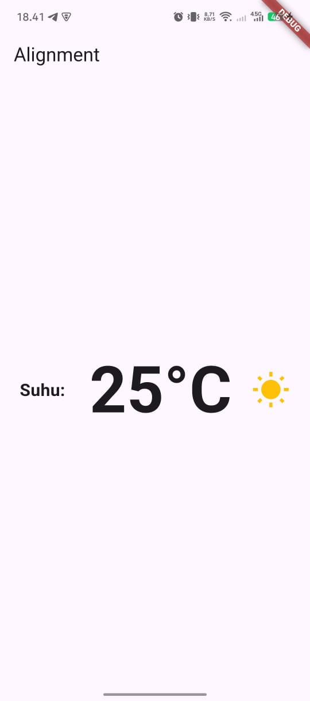
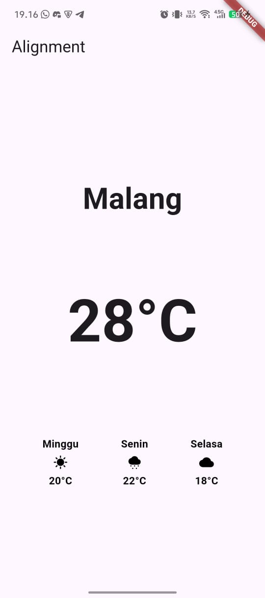

# Praktikum Modul 2 Layout Row and Column

## Documentation: lib/main.dart

1. Make a class for each weather type you want to create a widget for.
   - Example: SunnyWeather, RainWeather, CloudyWeather
2. Each class have custructor with required parameters for day and temperature.

```
class SunnyWheter extends StatelessWidget {
  final String day;
  final String temp;

  const SunnyWheter({super.key, required this.day, required this.temp});
```

3. Each class build method return a Container and have each icon like sunny, cloudy, cloudy_snowing

```
          Icon(Icons.cloudy_snowing, color: Colors.black, size: 20),
          Icon(Icons.sunny, color: Colors.black, size: 20),
          Icon(Icons.cloud, color: Colors.black, size: 20),
```

4. Reconfigure the main.dart to display the weather widgets in a Row and Column layout.

- Use Column to arrange the city name, current temperature, and a Row of weather widgets vertically.
- call the weather widgets inside the Row and fill in the day and temperature parameters.

```
children: [
              Text(
                'Malang',
                style: TextStyle(fontSize: 40, fontWeight: FontWeight.bold),
              ),
              SizedBox(height: 80),
              Text(
                '28\u00B0C',
                style: TextStyle(
                  fontSize: 80,
                  fontWeight: FontWeight.bold,
                  fontFamily: 'Roboto',
                ),
              ),
              SizedBox(height: 100),
              Row(
                mainAxisAlignment: MainAxisAlignment.spaceEvenly,
                children: [
                  SunnyWheter(day: 'Minggu', temp: '20\u00B0C'),
                  RainWheter(day: 'Senin', temp: '22\u00B0C'),
                  CloudyWheter(day: 'Selasa', temp: '18\u00B0C'),
                ], // or RainWheter(), CloudyWheter()
              ),
            ],
```

## Project Output (Screenshots)

1. Output 1: Temperature UI.  
   

2. Ouput 1: Wheater UI.  
   
