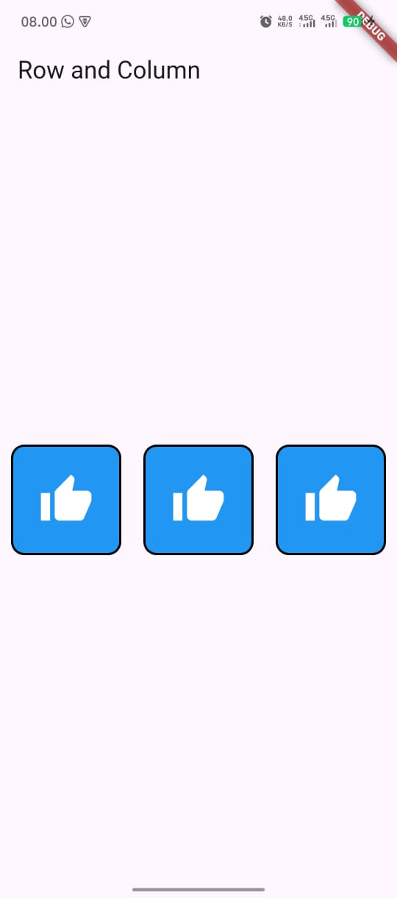
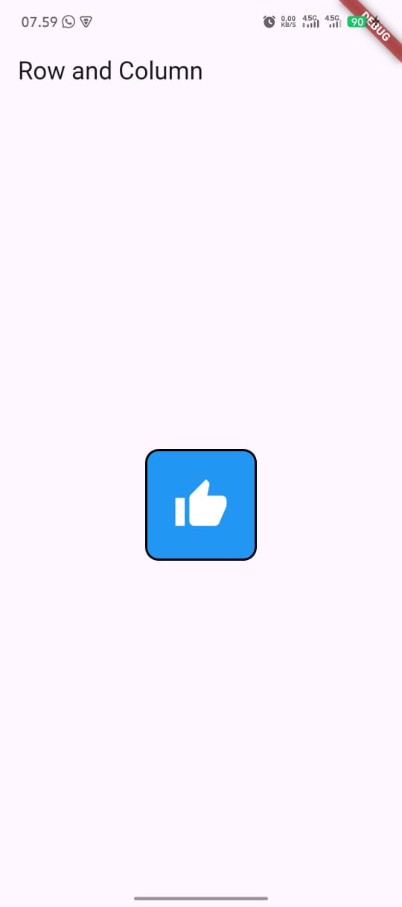
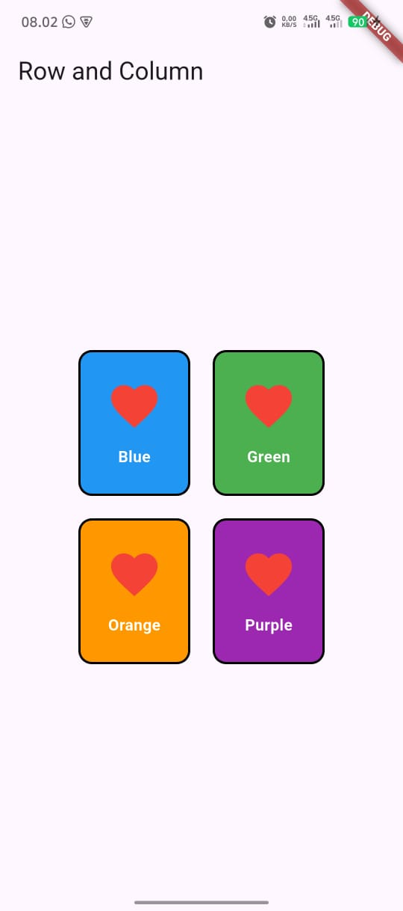

# Praktikum 1 Row and Column

A new Flutter project.

## Documentation: lib/main.dart

### Overview

This app demonstrates basic layout using Column and Row to display four colored boxes (KotakWarna) centered on the screen in a 2x2 arrangement.

- Column (centered) contains two Rows.
- Each Row (centered) contains two KotakWarna widgets separated by SizedBox spacing.
- KotakWarna shows a heart icon and a label over a colored background with rounded corners and border.

### Widget tree

```
MaterialApp
└─ Scaffold
   └─ Center
      └─ Column (mainAxisAlignment: center)
         ├─ Row (mainAxisAlignment: center)
         │  ├─ KotakWarna(warna: Colors.blue,   label: 'Blue')
         │  ├─ SizedBox(width: 20)
         │  └─ KotakWarna(warna: Colors.green,  label: 'Green')
         ├─ SizedBox(height: 20)
         └─ Row (mainAxisAlignment: center)
            ├─ KotakWarna(warna: Colors.orange, label: 'Orange')
            ├─ SizedBox(width: 20)
            └─ KotakWarna(warna: Colors.purple, label: 'Purple')
```

### KotakWarna component

- Type: StatelessWidget
- Props:
  - warna (Color, required): background color.
  - label (String, required): text displayed below the icon.
- Layout:
  - Container: width 100, height 130, rounded corners, 2px black border.
  - Child Column: centered Icon(Icons.favorite, red, size 50) and label text (white, bold).

### Customize

- Change colors/labels: update KotakWarna(warna: ..., label: ...).
- Adjust spacing: SizedBox(width: 20) between boxes, SizedBox(height: 20) between rows.
- Alignment: tweak mainAxisAlignment in Row/Column.
- Size/style: modify Container width/height, border, or Text style inside KotakWarna.

## Project Output (Screenshots)

Screenshots are stored in assets/screenshots.

- Output 1: Single thumbs icon.
  
  

- Output 2: Three thumbs icons arranged using Row and Column.
  
  

- Output 3: Favorites (heart) icon.
  
  

