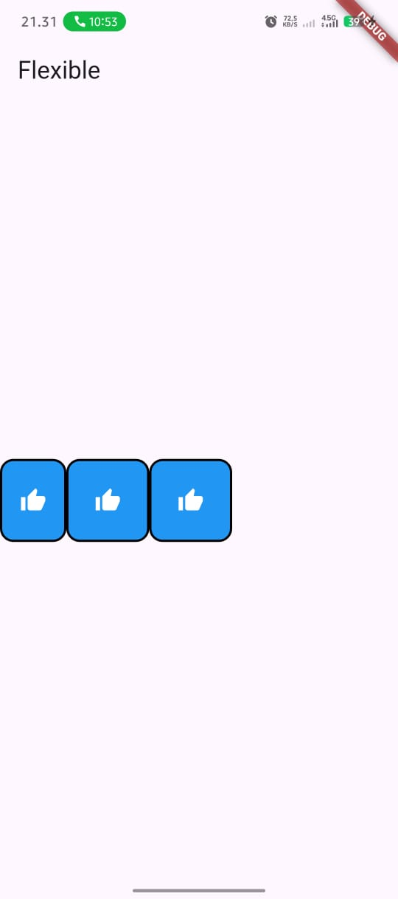
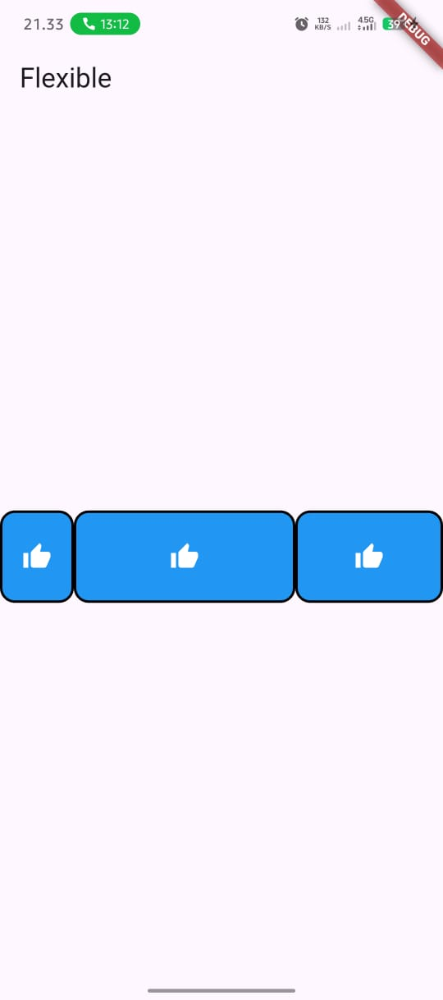
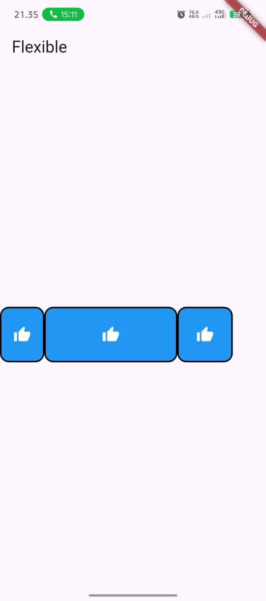
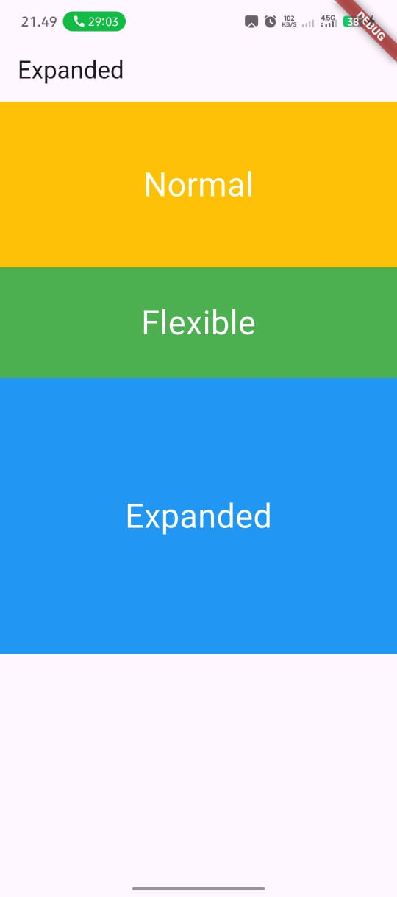

# Praktikum Modul 4 Widget Flexible and Expanded

A new Flutter project.

## Getting Started

This project is a starting point for a Flutter application.

A few resources to get you started if this is your first Flutter project:

- [Lab: Write your first Flutter app](https://docs.flutter.dev/get-started/codelab)
- [Cookbook: Useful Flutter samples](https://docs.flutter.dev/cookbook)

For help getting started with Flutter development, view the
[online documentation](https://docs.flutter.dev/), which offers tutorials,
samples, guidance on mobile development, and a full API reference.

## Documentation: lib/main.dart

### Overview

This app demonstrates basic layout using Column and Row to display four colored boxes (KotakWarna) centered on the screen in a 2x2 arrangement.

- Column (centered) contains two Rows.
- Each Row (centered) contains two KotakWarna widgets separated by SizedBox spacing.
- KotakWarna shows a heart icon and a label over a colored background with rounded corners and border.

### Widget Flexible and Expanded

#### Flexible Widget

The `Flexible` widget gives its child the flexibility to expand to fill available space in the main axis, but unlike `Expanded`, it's not forced to fill the available space.

- `flex`: An integer that determines the proportion of available space the flexible widget should occupy relative to other flexible widgets.
- Common use case: When you want a widget to take up a portion of the available space but not necessarily all of it.

Example usage:

```dart
Row(
  children: [
    Flexible(
      flex: 1,
      child: Container(color: Colors.red, height: 100),
    ),
    Flexible(
      flex: 2,
      child: Container(color: Colors.blue, height: 100),
    ),
  ],
)
```

In this example, the blue container takes up twice as much space as the red container.

#### Expanded Widget

The `Expanded` widget is a specialized version of `Flexible` that forces its child to fill all available space along the main axis.

- `flex`: Same as in Flexible, determines the proportion of space.
- Key difference: Expanded will always fill all available space, while Flexible will only expand up to the available space if needed.

Example usage:

```dart
Row(
  children: [
    Container(
      width: 100,
      color: Colors.green,
      height: 100,
    ),
    Expanded(
      child: Container(color: Colors.yellow, height: 100),
    ),
  ],
)
```

In this example, the green container takes 100 pixels, and the yellow container expands to fill the rest of the available width.

### Widget tree with Flexible/Expanded

```
MaterialApp
└─ Scaffold
   └─ Center
      └─ Column (mainAxisAlignment: center)
         ├─ Row (mainAxisAlignment: center)
         │  ├─ Flexible(flex: 1, child: KotakWarna(warna: Colors.blue, label: 'Blue'))
         │  ├─ SizedBox(width: 20)
         │  └─ Expanded(child: KotakWarna(warna: Colors.green, label: 'Green'))
         ├─ SizedBox(height: 20)
         └─ Row (mainAxisAlignment: center)
            ├─ Expanded(child: KotakWarna(warna: Colors.orange, label: 'Orange'))
            ├─ SizedBox(width: 20)
            └─ Flexible(flex: 2, child: KotakWarna(warna: Colors.purple, label: 'Purple'))
```

### KotakWarna component

- Type: StatelessWidget
- Props:
  - warna (Color, required): background color.
  - label (String, required): text displayed below the icon.
- Layout:
  - Container: width 100, height 130, rounded corners, 2px black border.
  - Child Column: centered Icon(Icons.favorite, red, size 50) and label text (white, bold).

#### Implementation Details

```dart
class KotakWarna extends StatelessWidget {
  final Color warna;
  final String label;

  const KotakWarna({
    Key? key,
    required this.warna,
    required this.label,
  }) : super(key: key);

  @override
  Widget build(BuildContext context) {
    return Container(
      width: 100,
      height: 130,
      decoration: BoxDecoration(
        color: warna,
        borderRadius: BorderRadius.circular(10),
        border: Border.all(color: Colors.black, width: 2),
      ),
      child: Column(
        mainAxisAlignment: MainAxisAlignment.center,
        children: [
          Icon(
            Icons.favorite,
            color: Colors.red,
            size: 50,
          ),
          const SizedBox(height: 8),
          Text(
            label,
            style: TextStyle(
              color: Colors.white,
              fontWeight: FontWeight.bold,
            ),
          ),
        ],
      ),
    );
  }
}
```

### Customize

- Change colors/labels: update KotakWarna(warna: ..., label: ...).
- Adjust spacing: SizedBox(width: 20) between boxes, SizedBox(height: 20) between rows.
- Alignment: tweak mainAxisAlignment in Row/Column.
- Size/style: modify Container width/height, border, or Text style inside KotakWarna.
- Flex factor: adjust flex values in Flexible and Expanded widgets to control proportion of space distribution.

## Project Output (Screenshots)

Screenshots are stored in assets/screenshots.

- Output 1:

  

- Output 2:

  

- Output 3:  
  

- Output 4: Flexible vs Expanded widgets

  

- Output 5: Flexible with different flex factors

  

- Output 6: Expanded widgets in a Column

  

- Output 7: Flexible with different flex factors

  

- Output 8:

  
