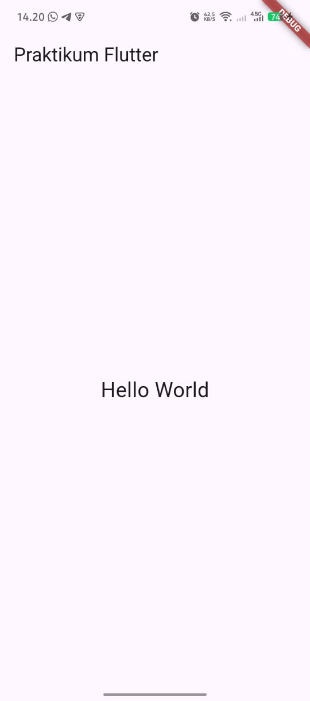
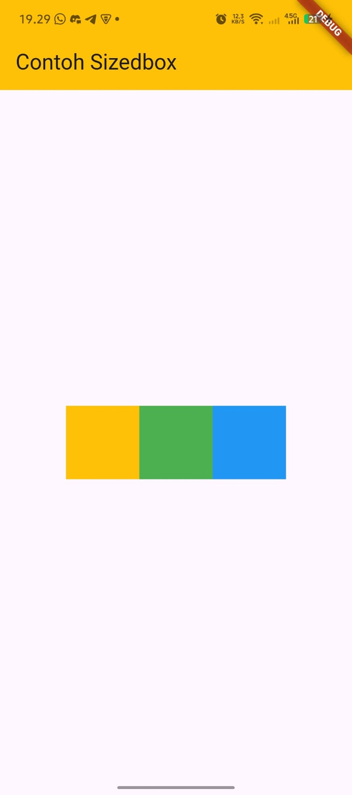
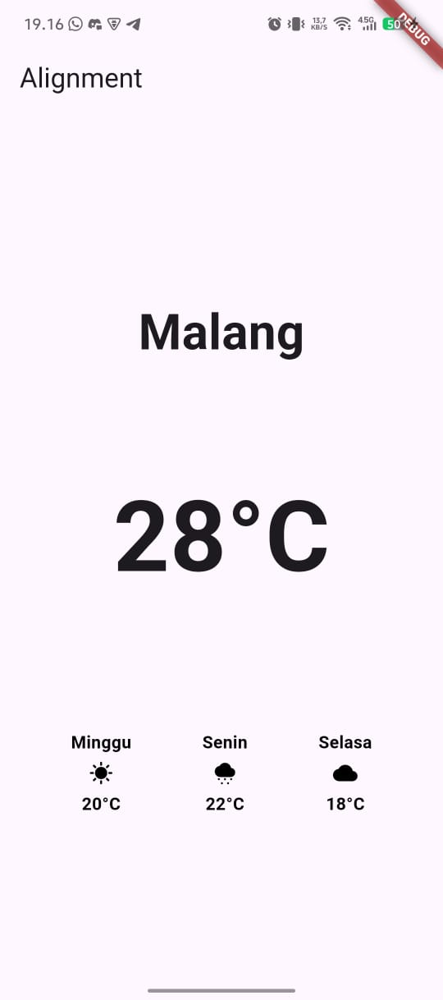
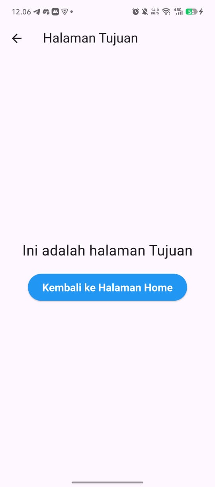
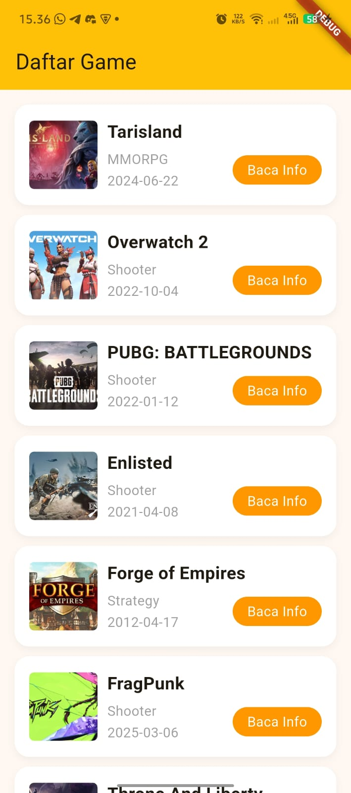
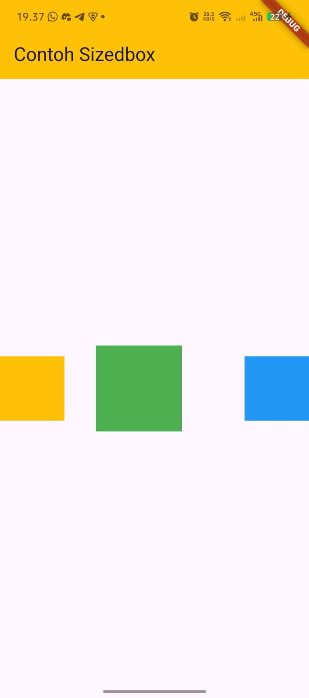
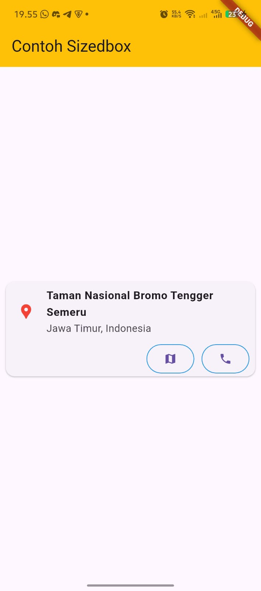
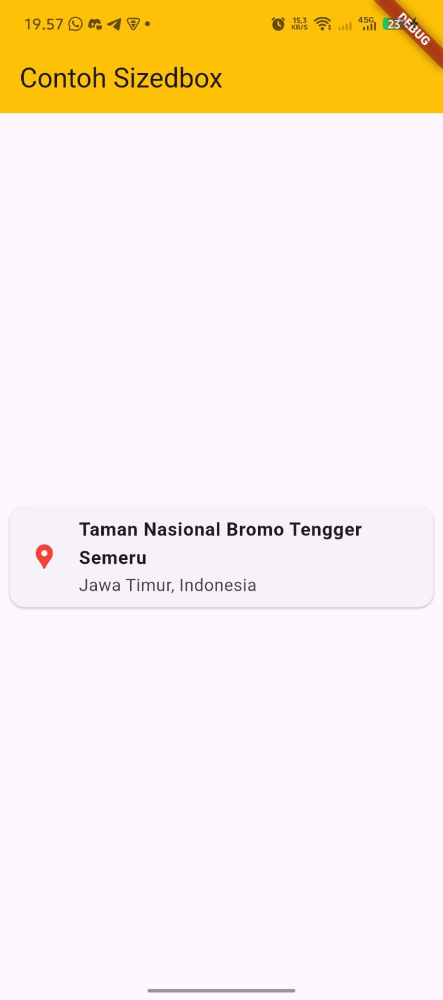

# Praktikum Modul 5 Widget SizedBox, Spacer, dan Card

A new Flutter project.

## Project Output (Screenshots)

Screenshots are stored in assets/screenshots.

- Output 1:

  

- Output 2:

  

- Output 3:

  

- Output 4:

  

- Output 5:

  

- Output 6:

  

- Output 7:

  

- Output 8:

  

- Output 9:

  
