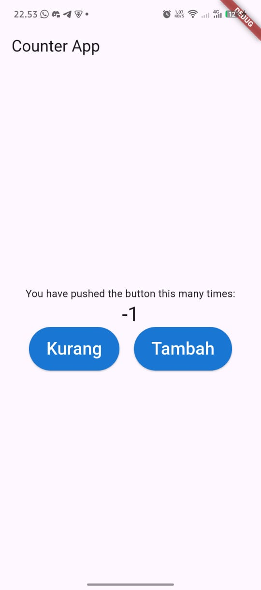

# Praktikum Modul 8 Navigation and Routing with call Args using Named Routes

A new Flutter project.

For Class Report you can check the document at:
https://docs.google.com/document/d/19zQDdrq2FUWzsz5V-gkyA-jFy3l-hvUFOet_gqOeXVM/edit?usp=sharing

## Project Output (Screenshots)

Screenshots are stored in assets/screenshots.

- Output 1: Using Navigator.push() and MaterialPageRoute() to go to a new page

```
onPressed: () {
    Navigator.push(
    context,
    MaterialPageRoute(builder: (context) => const Tujuan()),
  );
},
```

  

- Output 2: Using Navigator.pop() to return to the previous page

```
onPressed: () {
    Navigator.pop(context);
},
```

  

- Output 3: Using initial routes and named routes

```
initialRoute: '/',
routes: {
    '/': (context) => const HomePage(),
    '/second': (context) => const TujuanPage(),
},
```

  

- Output 4: Using Navigator.pushNamed() to navigate to a named route

```
onPressed: () {
    Navigator.pushNamed(context, '/tujuan');
},
```

  
